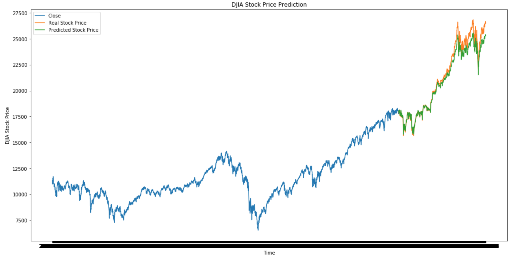

# LSTM_RNN_Prediction
Notes &amp; Application of Sequential Modeling in Stock Time Series Data

LSTM RNN is a type of Recurrent Neural Network (sequential model) which is particularly good at finding correlation between events, known as 'long-term dependencies'. As recurrent neural network, the model has a feedback loop which connects to past decisions, ingesting its own output to help predict for future data points. The model is therefore known to have memory, storing information in sequence itself.

Recurrent neural networks uses two sources of input:
1. Present Data
2. Recent Past Data

Following image is the output for which I used the LSTM RNN model to predict the closing price of Dow Jones Industrial Average. Below are steps I took to backtest it.

- Fetched closing prices of Dow Jones Industrial Average using Alpha Vantage API.
- Visualized univariate time series using plotly.
- Split dataset into training and validation datasets.
- Scaled dataset using MinMaxScaler
- Created X & Y data structure, taking 60 previous timestamps as input and consecutive 1 timestamp as output.
- Created and fit LSTM RNN Model
